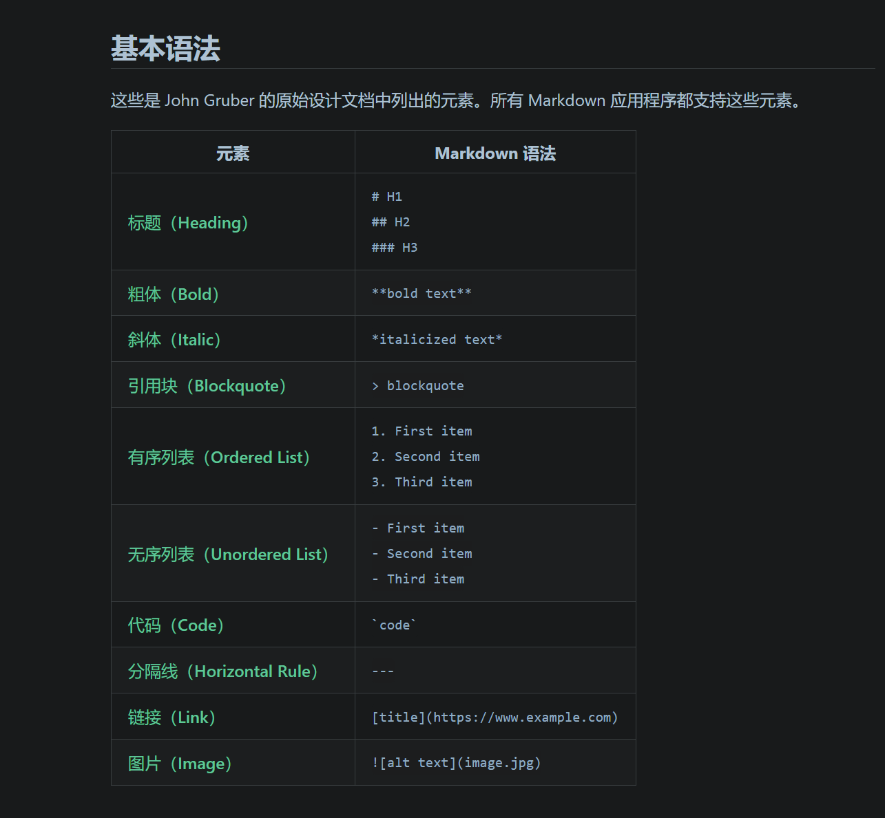

# 学习资源

1. [COD实验教程-markdown部分](https://soc.ustc.edu.cn/COD/other/markdown/)
这个是我们上学期某门课实验文档中的`markdown`教程，介绍了计算机专业学生最常用的一些语法。可能跟你的需求不完全相同；而且，里面部分内容（如图片插入）我觉得实现的不是很方便。
2. [Markdown官方教程](https://markdown.com.cn/intro.html)
官方教程，相当全面，你需要的所有东西里面应该都能找到。如果你只用来备课的话，绝大多数时候只会用到下面这张图的内容（~~简单吧~~）。

3. [Markdown-菜鸟教程](https://www.runoob.com/markdown/md-tutorial.html)
当时学的时候偶尔会查一下，但基本用不到。
4. [《了不起的Markdown》]()
刚放假时学了这本书，还是有不少收获，~~不过你应该不会看~~，要是尝试一下觉得好用的话以后可以看看，为了备课的话没有必要。
我没有在网上找到免费的资源，我们学校图书馆有电子书，但是需要登录才能看，我在z-library上给你下了一份。